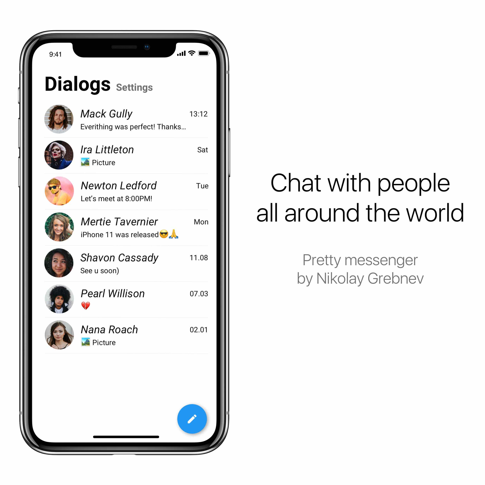
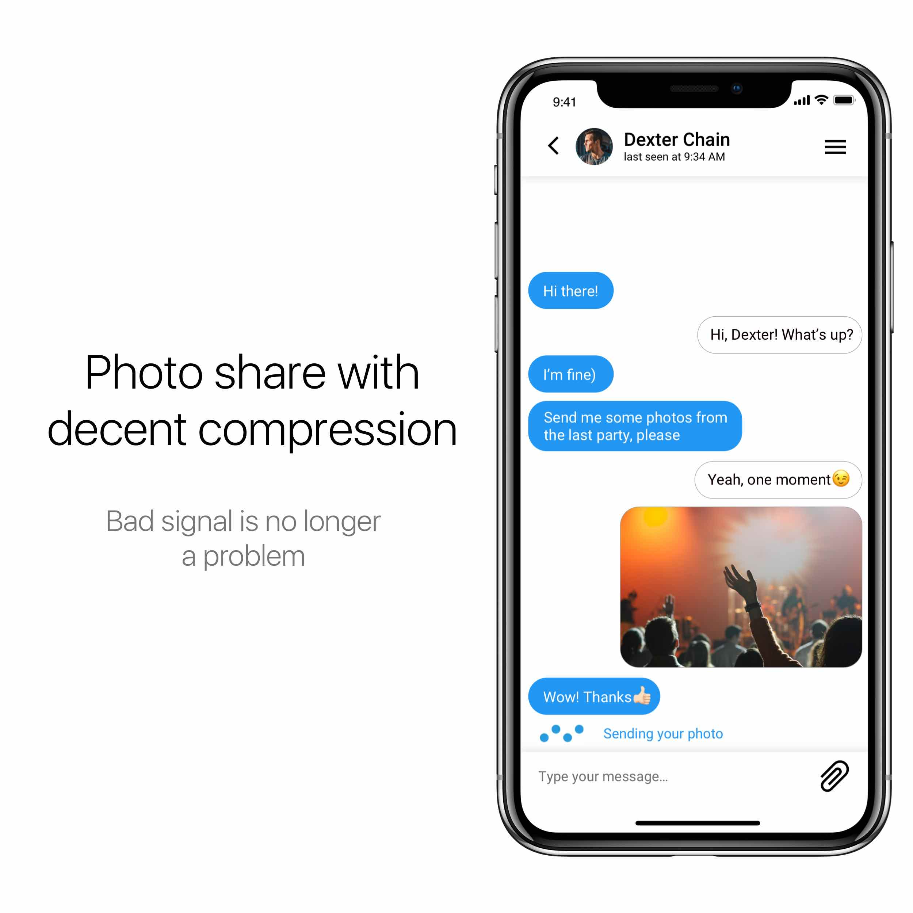
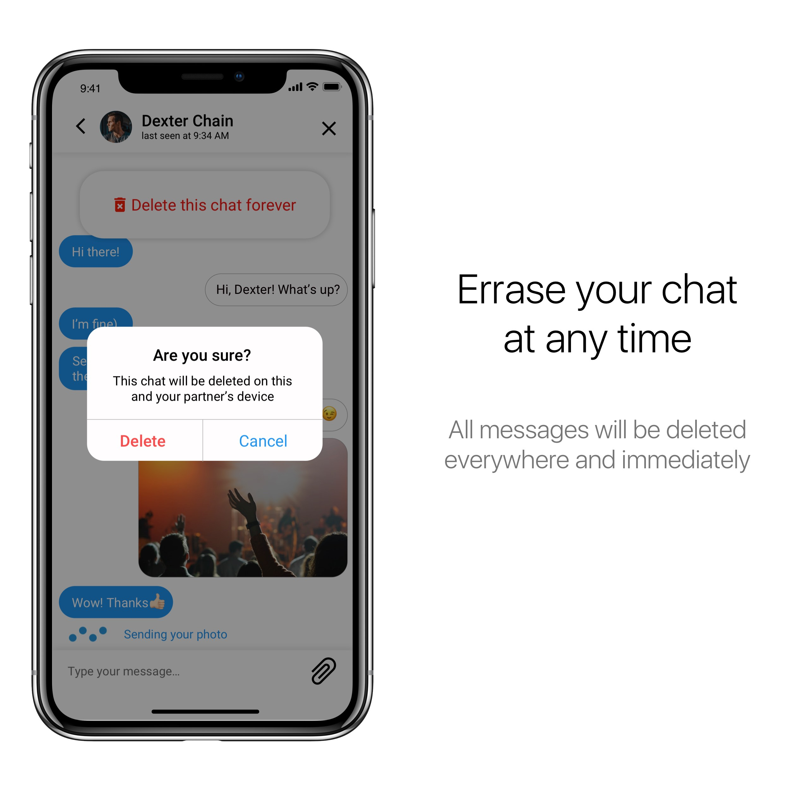
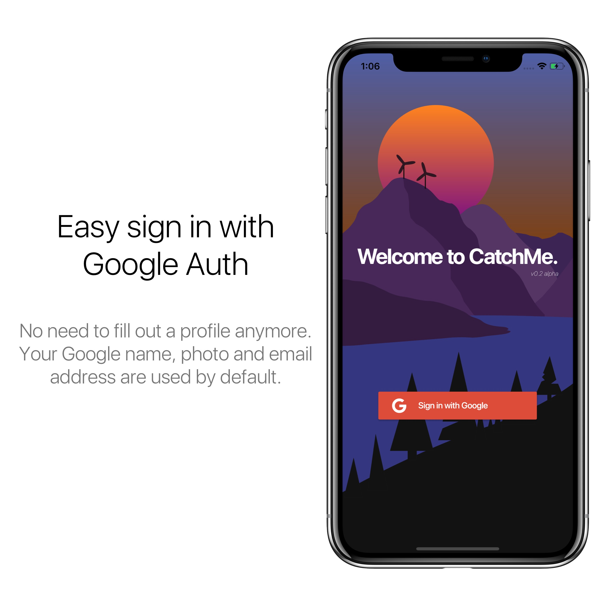

# CatchMe — Messenger

Cross-platform messenger created using the new Flutter technology.

Key features:
1) Log in using your Google account.
2) Sending messages.
3) Sending photos.
4) At any time, quickly delete the chat everywhere.
5) The ability to see when the other person last logged in.
6) Change the username and avatar.

